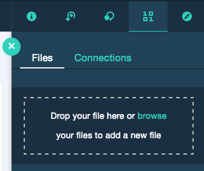
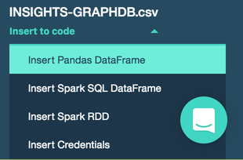
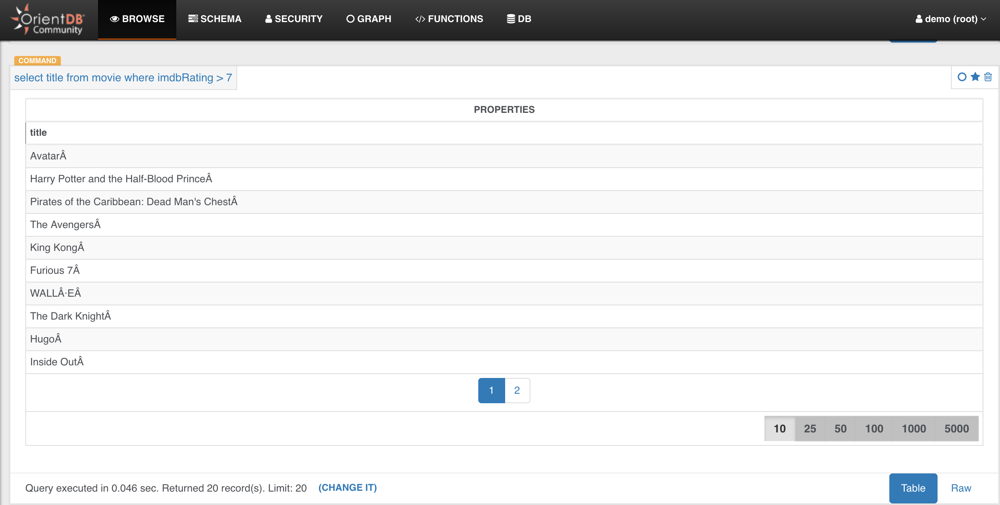
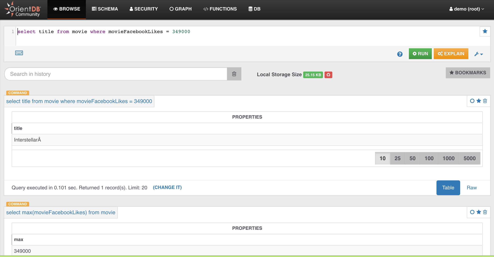

# Get insights from OrientDB database using PyOrient on IBM Data Science Experience (DSX)

The GraphDB Insight Journey gives you a head start on how to work with graph database OrientDB through IBM Data Science Experience(DSX) using PyOrient module - an OrientDB driver for python to operate on data and to get insights from OrientDB. IBM Data Science Experience can be used to analyze data using Jupyter notebooks.

OrientDB is a multi-model database, supporting graph, document, key/value, and object models, but the relationships are managed as in graph databases with direct connections between records. Graph databases are well-suited for analysing interconnections like to mine data from social media. It is also useful for working with data in business disciplines that involve complex relationships and dynamic schema and creating recommendations like "customers who bought this also looked at...". This journey will help you to understand end-to-end flow starting from downloading the data-set, cleansing of data, extract entities and relations from the data-set, connect with orientDB, create a new orientDB database, populate database with node classes, edge classes, vertices, relations and then execute queries to get more insights from the orientDB database. Unlike other Graph Databases like Neo4j which have their own graph querying language- Cypher, OrientDB have extended SQL to provide support for graph traversal in graph database making it easy for developers familiar with SQL to start exploring graph database for their business needs.

In this journey we will demonstrate:
* Setting up ipython notebook on DSX connecting to orientDB using pyorient.
* To perform the CRUD operations and extracting insights from orientDB database.

To achieve this, orientDB instance is created on the Kubernetes Cluster and then it is accessed through IBM DSX. This journey will help developers to get started with various orientDB operations like CRUD, basic traversal and extracting insights using pyorient on IBM DSX.

When the reader has completed this journey, they will understand how to:
- Create Kubernetes Cluster of OrientDB.
- Create and Run a Jupyter Notebook in DSX.
- Run OrientDB queries using PyOrient module in IBM DSX.
- Visualise the OrientDB result in OrientDB Studio.

1. The developer sets up the  [kubernetes cluster](https://github.com/IBM/container-journey-template) using kubernetes service on IBM Bluemix.
2. [The orientDB instance is deployed on the kubernetes cluster](https://github.com/IBM/deploy-graph-db-container) created by the developer in the first step with persistent volume, exposing the ports(2424, 2480) used by orientDB on bluemix.
3. The developer creates a Jupyter notebook on the [IBM Data science experience](http://datascience.ibm.com/) powered by spark. While creation of notebook, an instance of Object Storage is attached to the notebook for storing the data used by the notebook.
4. The developer uploads the [configuration file(config.json)](https://github.com/IBM/graph-db-insights/blob/master/configuration/config.json) and [Kaggle IMDb movie data(graph-insights.csv)](https://github.com/IBM/graph-db-insights/tree/master/data) in the object storage.
5. The credentials of the files from Object Storage are updated in the notebook and files are loaded to create graph database from them.
6. The notebook communicates with the orientDB through pyorient driver. And various operations are performed on the graph database using functions written in the Jupyter notebook.

## Included components

* [OrientDB](http://orientdb.com/orientdb/): A Multi-Model Open Source NoSQL DBMS.

* [IBM Data Science Experience](https://apsportal.ibm.com/analytics): Analyze data using RStudio, Jupyter, and Python in a configured, collaborative environment that includes IBM value-adds, such as managed Spark.

* [Bluemix Object Storage](https://console.ng.bluemix.net/catalog/services/object-storage/?cm_sp=dw-bluemix-_-code-_-devcenter): A Bluemix service that provides an unstructured cloud data store to build and deliver cost effective apps and services with high reliability and fast speed to market.

* [Jupyter Notebooks](http://jupyter.org/): An open-source web application that allows you to create and share documents that contain live code, equations, visualizations and explanatory text.

* [Kubernetes Clusters](https://console.bluemix.net/containers-kubernetes/launch): an open-source system for automating deployment, scaling, and management of containerized applications.

## Featured technologies

* [Data Science](https://medium.com/ibm-data-science-experience/): Systems and scientific methods to analyze structured and unstructured data in order to extract knowledge and insights.

## Prerequisite

Create a Kubernetes cluster with [IBM Bluemix Container Service](https://console.bluemix.net/containers-kubernetes/launch) to deploy in cloud. Deploy OrientDB on Kubernetes Cluster using [Deploy Orientdb on Kubernetes](https://github.com/IBM/deploy-graph-db-container). 

# Watch the Video
Watch this video to get an overview of this developer Journey.(Video yet to be made.)

# Steps

Follow these steps to setup and run this developer journey. The steps are
described in detail below.

1. [Deploy OrientDB on Kubernetes Cluster](#1-deploy-orientdb-on-kubernetes-cluster)
1. [Sign up for the Data Science Experience](#2-sign-up-for-the-data-science-experience)
1. [Create the notebook](#3-create-the-notebook)
1. [Add the data](#4-add-the-data)
1. [Update the notebook with service credentials](#5-update-the-notebook-with-service-credentials)
1. [Run the notebook](#6-run-the-notebook)
1. [Flow of the notebook](#7-flow-of-the-notebook)
1. [Analyze the results](#8-analyze-the-results)

## 1. Deploy OrientDB on Kubernetes Cluster
Deploy OrientDB on Kubernetes cluster using [Deploy Orientdb on Kubernetes](https://github.com/IBM/deploy-graph-db-container). It will expose the ports on IBM Bluemix through which OrientDB can be accessed from the Jupyter notebook on IBM DSX. Use the `ip-address of your cluster` and node port `port 2424` on which the orientDB console is mapped, to access that orientDB through Jupyter notebook.

## 2. Sign up for the Data Science Experience

Sign up for IBM's [Data Science Experience](http://datascience.ibm.com/). By signing up for the Data Science Experience, two services: ``DSX-Spark`` and ``DSX-ObjectStore`` will be created in your Bluemix account.

## 3. Create the notebook

* Open [IBM Data Science Experience](https://apsportal.ibm.com/analytics). 
* Use the menu on the top to select `Projects` and then `Default Project`.
* Click on `Add notebooks` (upper right) to create a notebook.
* Select the `From URL` tab.
* Enter a name for the notebook.
* Optionally, enter a description for the notebook.
* Enter this Notebook URL: https://github.com/IBM/graph-db-insights/blob/master/notebooks/graphdb-insights.ipynb
* Click the `Create Notebook` button.

 

## 4. Add the data 

##### Add the data to the notebook
* Please download the files from :
 https://www.kaggle.com/deepmatrix/imdb-5000-movie-dataset .
* Trim the data to 600 rows for the purpose of this tutorial and Rename the file  `Graphdb-Insights.csv`
* From your project page in DSX, click `Find and Add Data` (look for the `10/01` icon)
and its `Files` tab. 
* Click `browse` and navigate to `Graphdb-Insights.csv` on your computer.
* Add the files to Object storage.

* Repeat the above steps to upload `config.json` DSX configuration file to Object storage from URL:
  https://github.com/IBM/graph-db-insights/blob/master/configuration/config.json

## 5. Update the notebook with service credentials

##### Add the Object Storage credentials to the notebook
* Select the cell below `3. Add your service credentials for Object Storage` section in the notebook to update the credentials for Object Store.
* Use `Find and Add Data` (look for the `10/01` icon) and its `Files` tab. You should see the file names uploaded earlier. Make sure your active cell is the empty one created earlier. 
* Select `Insert to code` below config.json and click insert credentials from the dropdown.

* Select the cells below `4. Loading the Configuration and Data Files.` to load the files used by the notebook.
* Run the cell below `4.1. Loading the config.json` to load the configuration file.
* Select `Insert to code` below Graphdb-Insights.csv(movie dataset) and click Insert Pandas Dataframe from the dropdown in the next cell `4.2. Loading the Imdb movie data`

## 6. Flow of the notebook
The notebook has been divided into various sections with each section performing a specific task on the OrientDB.
* `Setup` which deals with the installation of the orientDB, importing the packages and libraries, adding the credentials of the files from object storage and loading them in the notebook for use.
* `Core functions and Utlitiy Functions`.The utility functions are basically to keep a check on the duplicacy as `IF NOT EXISTS` is only valid for creating the properties in the OrientDB. Unlike in SQL, `IF NOT EXISTS` doesn't work with `create class` or `insert` statements in OrientDB. The core functions are for operations performed over OrientDB.
* `Insights and Visualization` which focuses on  performing various operations on and get insights from the OrientDB database.

## 7. Run the notebook

When a notebook is executed, what is actually happening is that each code cell in
the notebook is executed, in order, from top to bottom.

Each code cell is selectable and is preceded by a tag in the left margin. The tag
format is `In [x]:`. Depending on the state of the notebook, the `x` can be:

* A blank, this indicates that the cell has never been executed.
* A number, this number represents the relative order this code step was executed.
* A `*`, this indicates that the cell is currently executing.

There are several ways to execute the code cells in your notebook:

* One cell at a time.
  * Select the cell, and then press the `Play` button in the toolbar.
* Batch mode, in sequential order.
  * From the `Cell` menu bar, there are several options available. For example, you
    can `Run All` cells in your notebook, or you can `Run All Below`, that will
    start executing from the first cell under the currently selected cell, and then
    continue executing all cells that follow.
* At a scheduled time.
  * Press the `Schedule` button located in the top right section of your notebook
    panel. Here you can schedule your notebook to be executed once at some future
    time, or repeatedly at your specified interval.

For this Notebook, to run every cell one by one is recommended so as to understand the flow of the notebook and also to comprehend  the operation performed by each cell on orientDB better.

## 8. Analyze the results

The notebook uses two usecases to demonstrate how to get insights from the orientDB like `the most mentioned movie` and the `clustering of the movies with IMDb rating greater than 7.` Each Insight has its own function in the notebook.You can make a call to that function to get the results.Check the image shown below:

OrientDB also provides an interactive dashboard orientDB studio for visualisation of the graph and to view the results of the queries. You can run the queries in the browse section of the orientDB studio to get the desired insights or to create the node and Edges. The same two queries which the notebook uses can be executed in the browse section of the OrientDB to analyze the results, check the images for the same.The results of the query executed, is in the form of table and JSON.But they can also be downloaded as csv for further analysis. 

To visualise the graph created by using the functions written in the notebook, 
* open the graph editor of the orientDB Studio 
* execute the graph query in the graph editor.
* results of the query will be in the form of graph. For example, To find the connections of a node in the graphdb i.e. `to find the coworkers of the actor Tom Hanks `, 

* You can follow this video tutorial on [orientDB studio](https://www.youtube.com/watch?v=l-OVSjf-vk0&t=7s) created for the purpose of this notebook to demonstrate the results of the queries used in the tutorial.
